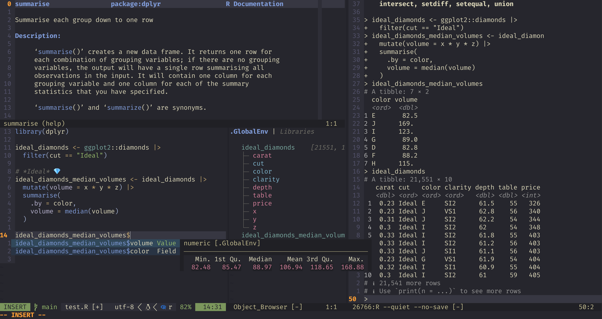

# R.nvim

R.nvim adds R support to Neovim, including:

- Communication with R via Neovim's built-in terminal or tmux

- A built-in object explorer and autocompletions built from your R environment

- Keyboard shortcuts for common inserts like `<-` and `|>`

- Quarto/R Markdown support

- ...And much more!

<p align="center">
    
</p>

## Installation

Please, see the list of dependencies at section 3.1 of
[doc/R.nvim.txt](https://github.com/R-nvim/R.nvim/blob/main/doc/R.nvim.txt).

Here's a (very) minimal configuration using
[lazy.nvim](https://github.com/folke/lazy.nvim) (not including `R.nvim`
dependencies):

```lua
{
    "R-nvim/R.nvim",
     -- Only required if you also set defaults.lazy = true
    lazy = false
},
```

A longer example adding some custom behaviour:

```lua
{
    "R-nvim/R.nvim",
     -- Only required if you also set defaults.lazy = true
    lazy = false,
    -- R.nvim is still young and we may make some breaking changes from time
    -- to time (but also bug fixes all the time). If configuration stability
    -- is a high priority for you, pin to the latest minor version, but unpin
    -- it and try the latest version before reporting an issue:
    -- version = "~0.1.0"
    config = function()
        -- Create a table with the options to be passed to setup()
        ---@type RConfigUserOpts
        local opts = {
            hook = {
                on_filetype = function()
                    vim.api.nvim_buf_set_keymap(0, "n", "<Enter>", "<Plug>RDSendLine", {})
                    vim.api.nvim_buf_set_keymap(0, "v", "<Enter>", "<Plug>RSendSelection", {})
                end
            },
            R_args = {"--quiet", "--no-save"},
            min_editor_width = 72,
            rconsole_width = 78,
            objbr_mappings = { -- Object browser keymap
                c = 'class', -- Call R functions
                ['<localleader>gg'] = 'head({object}, n = 15)', -- Use {object} notation to write arbitrary R code.
                v = function()
                    -- Run lua functions
                    require('r.browser').toggle_view()
                end
            },
            disable_cmds = {
                "RClearConsole",
                "RCustomStart",
                "RSPlot",
                "RSaveClose",
            },
        }
        -- Check if the environment variable "R_AUTO_START" exists.
        -- If using fish shell, you could put in your config.fish:
        -- alias r "R_AUTO_START=true nvim"
        if vim.env.R_AUTO_START == "true" then
            opts.auto_start = "on startup"
            opts.objbr_auto_start = true
        end
        require("r").setup(opts)
    end,
},
```

See the plugin [documentation](doc/R.nvim.txt) for a complete list of
possible options. You can also consult the [Wiki](https://github.com/R-nvim/R.nvim/wiki).

### Autocompletion

R autocompletion should be configured via another plugin. We recommend
[cmp-r](https://github.com/R-nvim/cmp-r), which can be minimally configured
like so:


``` lua
{
    "R-nvim/cmp-r",
    {
        "hrsh7th/nvim-cmp",
        config = function()
            require("cmp").setup({ sources = {{ name = "cmp_r" }}})
            require("cmp_r").setup({})
        end,
    },
},
```

Note that [languageserver](https://github.com/REditorSupport/languageserver)
can also be used for autocompletions, but using autocompletions from both
sources simultaneously is not advised.

### Tree-sitter

Tree-sitter is required to enable much of the functionality of R.nvim, and can
be minimally configured like so:

``` lua
{
    "nvim-treesitter/nvim-treesitter",
    run = ":TSUpdate",
    config = function ()
        require("nvim-treesitter.configs").setup({
            ensure_installed = { "markdown", "markdown_inline", "r", "rnoweb", "yaml", "latex", "csv" },
            highlight = { enable = true },
        })
    end
},
```


## Usage

Please see the [documentation](doc/R.nvim.txt) for instructions on usage. For a
complete list of keymaps, see the output of `:RMapsDesc`.

## Lifecycle

R.nvim is still maturing and its public API (configuration options,
commands, and some of the Lua internals) may undergo breaking changes from
time to time. This project uses [semantic versioning](https://semver.org/) to
help with this, and we will always bump the minor version, e.g. from 0.1.x to
0.2.0, when we make a breaking change. Users are thus encouraged to pin their
installation of R.nvim to the **latest minor release** and to check the release
notes for any breaking changes when upgrading.

Eventually we plan to release a version 1.0.0, at which point we will make a
firm commitment to backwards compatibility.

## Transitioning from Nvim-R

### Removed features:

- reStructuredText support (no longer seems to be widely used).

- Debugging support (a formal debug adaptor would be a better solution).

- Legacy omni-completion (we now recommend
    [nvim-cmp](https://github.com/hrsh7th/nvim-cmp)).

- Highlighting functions from `.GlobalEnv` (difficult to make compatible with
    tree-sitter + LSP highlighting).

- The `echo` argument for functions that send code to R console has been
    removed. Users can still set the `source_args` to define the arguments that
    will be passed to `base::source()` and include the argument `echo=TRUE`.
    `max_lines_to_paste` can now be used to set the number of lines which can be
    sent directly to the R Console without saving the code in a temporary file.

- Rnoweb chunk headers with options are not supported by tree-sitter. You have
  to write the options at the top of the code block after the `#|` comment
  strings as is common in Quarto documents. See
  [execution-options](https://quarto.org/docs/computations/execution-options.html).

- Integration with `Rapp` on macOS was removed (option `applescript`).

### Changes:

- `<M-->` (i.e. `Alt + -`) is now used to insert `<-`. See the documentation
  on how to create custom key bindings.

- `R_source` and `after_R_start` have been replaced with more powerful `hook`
    options.

- `nvimpager`, which controls how R documentation is displayed, now has possible
    options `"split_h"`, `"split_v"`, `"tab"`, `"float"` (not implemented yet),
    and `"no"`.

- `open_pdf` replaces `openpdf` and `openhtml`; see the documentation for
    details.

- `setwd` replaces `nvim_wd`. The new default value is `"no"`.

- Only strings are valid values for `external_term`.

- `config_tmux` replaces `notmuxconf`. The new default value is `true`.

- `:RFormat` now requires {styler} to be installed; {formatR} is no longer
    supported.

- `view_df` is a table replacing the options `csv_app`,
  `csv_delim`, and `df_viewer`. The commands to see a `data.frame`
  or `matrix` in a split window were eliminated. See the documentation
  on `view_df` for alternative ways of getting similar results.

- `rmdchunk` and `rnowebchunk` were removed. In Insert mode, press `<M-r>` to
  insert chunks of R code in Rmd, Quarto or Rnoweb. See the documentation on
  how to create custom key bindings.

### New features

#### New commands

- `:RMapsDesc` displays the list of key bindings followed by short
  descriptions.

- `:RConfigShow` displays the list of configuration options and their current
  values.

#### New keybindings

- `<LocalLeader>sc` sends a piped chain of commands.

- `<LocalLeader>ip` installs missing packages detected by
    [languageserver](https://github.com/REditorSupport/languageserver).

- `<LocalLeader>sp` splits a filepath under the cursor into individual
    components concatenated using either `"here::here"` (the default),
    `"here"`, `"file.path"`, `"fs::path"`, or `"path"`, depending on how
    `path_split_fun` is set. Requires
    [nvim-treesitter](https://github.com/nvim-treesitter/nvim-treesitter) to be
    installed).

- `<LocalLeader>,` inserts a pipe operator (`|>`).

#### New options

- `auto_quit` can be configured to automatically quit R when you quit Neovim.

- `rproj_prioritise` can be configured to control how `.Rproj` files change the
    behaviour of R.nvim. Amongst other things, this may affect whether
    `<LocalLeader>,` inserts `|>` or `%>%`.

- `objbr_mappings` can be configured to run R commands on objects in the
    current session.

## Screenshots and videos

None yet! Please let us know if you publish a video presenting R.nvim features 😃

## Troubleshooting

- [colorout](https://github.com/jalvesaq/colorout): If you have [colorout]
    installed and are *not* loading it in your `~/.Rprofile`, it should be
    version `1.3-1` or higher. This is because R.nvim uses
    `colorout::isColorOut()` which in previous `colorout` versions was unduly
    enabling the output colorizing.


## How R.nvim communicates with your R session

The diagram below shows how the communication between Neovim and R works.


The black arrows represent all commands that you trigger in the editor and
that you can see being pasted into R Console.
There are three different ways of sending the commands to R Console:

- When running R in a Neovim built-in terminal, the function `chansend()`
  is used to send code to R Console.

- When running R in an external terminal emulator, Tmux is used to send
  commands to R Console.

- On the Windows operating system, if using the `Rgui.exe` as "external
  terminal", Nvim-R can send a message to R (nvimcom) which forwards the
  command to R Console.

The R package _nvimcom_ includes the application _rnvimserver_ which is never
used by R itself but is run as a Neovim's job. That is, the communication
between the _rnvimserver_ and Neovim is through the _rnvimserver_ standard
input and output (green arrows). The _rnvimserver_ application runs a TCP
server. When _nvimcom_ is loaded, it immediately starts a TCP client that
connects to _rnvimserver_ (red arrows).

Some commands that you trigger are not pasted into R Console and do not output
anything in the R Console; their results are seen in the editor itself. These are
the commands to do auto completion (of names of objects and function
arguments), start and manipulate the Object Browser (`\ro`, `\r=` and `\r-`),
call R help (`\rh` or `:Rhelp`), insert the output of an R command
(`:Rinsert`), and format selected text (`:Rformat`).

When new objects are created or new libraries are loaded, nvimcom sends
messages that tell the editor to update the Object Browser, update the syntax
highlight to include newly loaded libraries and open the PDF output after
knitting an Rnoweb file, and compiling the LaTeX result. Most of the
information is transmitted through the TCP connection to the _rnvimserver_,
but temporary files are used in a few cases.

## See also:

- [cmp-r](https://github.com/R-nvim/cmp-r): autocompletion source for
    [nvim-cmp](https://github.com/hrsh7th/nvim-cmp) using R.nvim as backend.

- [languageserver](https://github.com/REditorSupport/languageserver): a
    language server for R.

- [colorout](https://github.com/jalvesaq/colorout): a package to colorize R's
    output.

- [Ark](https://github.com/posit-dev/ark): a LSP server/DAP server/Jupyter kernel
    for R.

- [southernlights](https://github.com/jalvesaq/southernlights): a colourscheme
    for vim.


