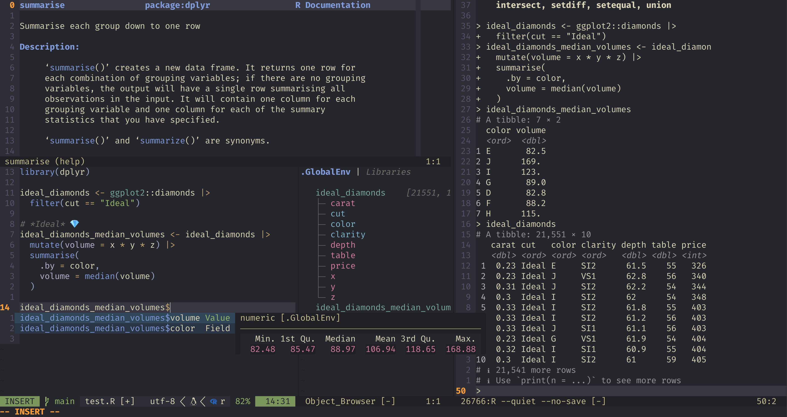

[](https://github.com/R-nvim/R.nvim/actions/workflows/ci.yml)

# R.nvim

> [!Note]
> Vim-R users should read the release notes of [version 1.0.0](https://github.com/R-nvim/R.nvim/releases/tag/v1.0.0).

R.nvim adds R support to Neovim, including:

- Communication with R via Neovim's built-in terminal or tmux

- A built-in object explorer and autocompletions built from your R environment

- Keyboard shortcuts for common inserts like `<-` and `|>`

- Quarto/R Markdown/Rtypst support

- ...And much more!

<p align="center">
    
</p>

The `R.nvim` directory has four different things:

  - A R package (subdirectory `nvimcom`).

  - The C code of an language server for R (subdirectory `rnvimserver`).

  - A tree-sitter parser for `.Rout` files (Git submodule `tree-sitter-rout`
    in the subdirectory `resources`).

  - A Lua plugin for Neovim (most of everything else).

R.nvim automatically:

 - builds and install the R package `nvimcom`;
 - compiles the `rnvimserver` binary in the `rnvimserver` directory;
 - generates the `rout` parser and installs it in the `parser` subdirectory.

## Installation

The `R.nvim` repository must be cloned with its submodule `tree-sitter-rout`.
If your plugin manager does not clone the submodules, you can clone the
repository manually with this command:

```sh
git clone --recurse-submodules https://github.com/R-nvim/R.nvim
```

Please, see the list of dependencies at section 3.1 of
[doc/R.nvim.txt](https://github.com/R-nvim/R.nvim/blob/main/doc/R.nvim.txt).

Here's a (very) minimal configuration using
[lazy.nvim](https://github.com/folke/lazy.nvim) (not including `R.nvim`
dependencies):

```lua
{
    "R-nvim/R.nvim",
     -- Only required if you also set defaults.lazy = true
    lazy = false
},
```

A longer example adding some custom behaviour:

```lua
{
    "R-nvim/R.nvim",
     -- Only required if you also set defaults.lazy = true
    lazy = false,
    -- R.nvim is still young and we may make some breaking changes from time
    -- to time (but also bug fixes all the time). If configuration stability
    -- is a high priority for you, pin to the latest minor version, but unpin
    -- it and try the latest version before reporting an issue:
    -- version = "~0.1.0"
    config = function()
        -- Create a table with the options to be passed to setup()
        ---@type RConfigUserOpts
        local opts = {
            hook = {
                on_filetype = function()
                    vim.api.nvim_buf_set_keymap(0, "n", "<Enter>", "<Plug>RDSendLine", {})
                    vim.api.nvim_buf_set_keymap(0, "v", "<Enter>", "<Plug>RSendSelection", {})
                end
            },
            R_args = {"--quiet", "--no-save"},
            min_editor_width = 72,
            rconsole_width = 78,
            objbr_mappings = { -- Object browser keymap
                c = 'class', -- Call R functions
                -- Use {object} notation to write arbitrary R code.
                ['<localleader>gg'] = 'head({object}, n = 15)',
                v = function()
                    -- Run lua functions
                    require('r.browser').toggle_view()
                end
            },
            disable_cmds = {
                "RClearConsole",
                "RCustomStart",
                "RSPlot",
                "RSaveClose",
            },
        }
        -- Check if the environment variable "R_AUTO_START" exists.
        -- If using fish shell, you could put in your config.fish:
        -- alias r "R_AUTO_START=true nvim"
        if vim.env.R_AUTO_START == "true" then
            opts.auto_start = "on startup"
            opts.objbr_auto_start = true
        end
        require("r").setup(opts)
    end,
},
```

See the plugin [documentation](doc/R.nvim.txt) for a complete list of
possible options.
You can also consult the [Wiki](https://github.com/R-nvim/R.nvim/wiki) and
[R.nvim-config-examples](https://github.com/R-nvim/R.nvim-config-examples).

### Autocompletion

R autocompletion is provided by a built-in language server.

Note that [languageserver](https://github.com/REditorSupport/languageserver)
can also be used for autocompletions, but using autocompletions from both
sources simultaneously is not advised.

### Tree-sitter

The following Tree-sitter parsers are required:

  - `r` for all file types.
  - `csv` to view data.frame and matrixes in a Neovim buffer.
  - `markdown`, and `markdown_inline` for Rmd and Quarto.
  - `latex`, and `rnoweb` for Rnoweb.
  - `typst` for RTypst.
  - `yaml` for Rmd, Quarto, Rnoweb and RTypst.

The parsers can be installed with any Tree-sitter parser manager, such as
[nvim-treesitter](https://github.com/nvim-treesitter/nvim-treesitter) or
[tree-sitter-manager.nvim](https://github.com/romus204/tree-sitter-manager.nvim).

Example configuration using nvim-treesitter:

```lua
{
    "nvim-treesitter/nvim-treesitter",
    branch = "main",
    lazy = false,
    build = ":TSUpdate",
    config = function()
        local langs = { "markdown", "markdown_inline", "r", "rnoweb", "yaml", "latex", "csv" }
        require("nvim-treesitter").install(langs)

        vim.api.nvim_create_autocmd("FileType", {
            pattern = langs,
            callback = function()
                vim.treesitter.start()
            end,
        })
    end,
}
```

## Usage

Please see the [documentation](doc/R.nvim.txt) for instructions on usage. For a
complete list of keymaps, see the output of `:RMapsDesc`.

## Lifecycle

R.nvim is still maturing and its public API (configuration options,
commands, and some of the Lua internals) may undergo breaking changes from
time to time. This project uses [semantic versioning](https://semver.org/) to
help with this, and we will always bump the minor version, e.g. from 0.1.x to
0.2.0, when we make a breaking change. Users are thus encouraged to pin their
installation of R.nvim to the **latest minor release** and to check the release
notes for any breaking changes when upgrading.

Eventually we plan to release a version 1.0.0, at which point we will make a
firm commitment to backwards compatibility.

## Screenshots and videos

None yet! Please let us know if you publish a video presenting R.nvim features
😃

## Troubleshooting

- [colorout](https://github.com/jalvesaq/colorout): If you have [colorout]
  installed and are _not_ loading it in your `~/.Rprofile`, it should be
  version `1.3-1` or higher. This is because R.nvim uses
  `colorout::isColorOut()` which in previous `colorout` versions was unduly
  enabling the output colorizing.

## How R.nvim communicates with R

The diagram below shows how the communication between Neovim and R works.


The black arrows represent all commands that you trigger in the editor and
that you can see being pasted into R Console.
There are three different ways of sending the commands to R Console:

- When running R in a Neovim built-in terminal, the function `chansend()`
  is used to send code to R Console.

- When running R in an external terminal emulator, Tmux is used to send
  commands to R Console.

- Some terminal emulators have built-in multiplexer capabilities and can be
  used without Tmux.

The application _rnvimserver_ runs as a language server that communicates with
Neovim through the standard input/output, but it also includes a TCP
server. When _nvimcom_ is loaded, it immediately starts a TCP client that
connects to _rnvimserver_ (red arrows).

Some commands that you trigger are not pasted into R Console and do not output
anything in the R Console; their results are seen in the editor itself. These
are the commands to do auto completion (of names of objects and function
arguments), start and manipulate the Object Browser (`\ro`, `\r=` and `\r-`),
call R help (`\rh` or `:Rhelp`), insert the output of an R command
(`:Rinsert`), and format selected text (`:Rformat`).

When new objects are created or new libraries are loaded, _nvimcom_ sends
messages that tell the editor to update the Object Browser, update the syntax
highlight to include newly loaded libraries, and open the PDF output after
knitting an Rnoweb file, and compiling the LaTeX result. Most of the
information is transmitted through the TCP connection to the _rnvimserver_,
but temporary files are used in a few cases.

## See also:

- [languageserver](https://github.com/REditorSupport/languageserver): a
  language server for R.

- [colorout](https://github.com/jalvesaq/colorout): a package to colorize R's
  output.
